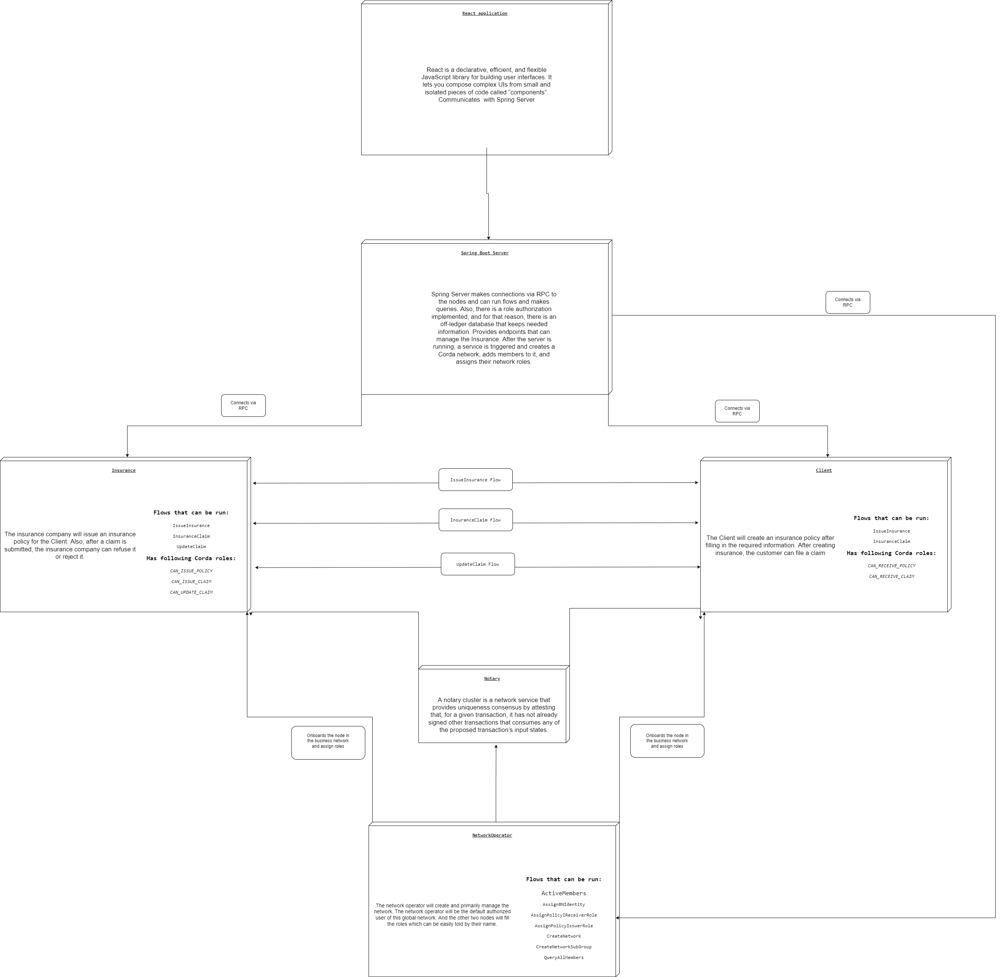

# Insurance Business Network

### Concept:

In this app, we will have a global insurance network, where participants are either insurance companies or client. With
the help of business network extension, we can further breakdown the global network into smaller pieces as groups.

In our app, we will have three nodes, named as:

* NetworkOperator <- Business Network Operator
* Insurance <- Insurance Company that is in the network
* Client <- Client that wants an insurance

The NetworkOperator will be created and primarily manage the network. NetworkOperator will be the default authorized
user of this global network, and the other two nodes will fill the roles which can be easily tell by its name.

This is architecture scheme of the app

### [How to use Spring](documentation/Spring.md)

### [How to use Corda app](documentation/Corda.md)

### [How to use React](documentation/React.md)
